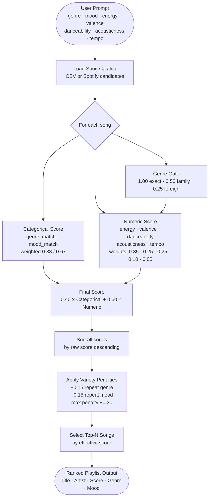

# Visualization Instructions for MoodSync Scoring Formula

## Overview
Generate interactive visualizations that show how the music recommendation scoring formula calculates a recommendation score. These visualizations apply regardless of the data source — the same formula is used whether songs come from the default 35-song CSV catalog or a live Spotify candidate pool.

Focus on showing:
1. Component interactions (categorical vs. numeric features)
2. Weight distribution and their impact
3. Step-by-step calculation flow
4. Sensitivity analysis (how changes in inputs affect output)

**Data source note:** Sample data below uses songs from `data/songs.csv`. When Spotify integration is active, the same formula and visualization logic applies — substitute Spotify-sourced song dicts (same schema) for CSV rows.

---

## Visualization 0: End-to-End Flow (User Prompt → Final Output)

### Description
A simple flowchart tracing the full journey from user input to ranked playlist output.

### Mermaid Diagram



---

## Visualization 1: Scoring Formula Components Breakdown

### Description
A hierarchical diagram showing how the overall SCORE is computed from sub-components.

### Structure
```
┌─────────────────────────────────────────┐
│         OVERALL SCORE (0-1)             │
│      = 0.40 × Cat + 0.60 × Num         │
└──────────────┬──────────────────────────┘
               │
       ┌───────┴───────┐
       │               │
   ┌───▼────────┐   ┌──▼──────────────┐
   │ Categorical│   │   Numeric Score │
   │  Score     │   │   (0.60 weight) │
   │(0.40 weight)   │                 │
   └───┬────────┘   └──┬──────────────┘
       │               │
   ┌───┴────┐      ┌───┴──────────────┐
   │         │      │                  │
(Genre)  (Mood) (Energy) (Valence) (Dance) (Acoustic) (Tempo)
 1.0      1.0     0.35     0.25     0.25    0.10      0.05
match    match    weight   weight   weight  weight    weight
```

### Key Elements to Show
- Node hierarchy with labels
- Weight percentages at each branch (0.40 and 0.60 split)
- Further breakdown of numeric_score into 5 features with their weights
- genre_gate multiplier (1.00 / 0.50 / 0.25) applied to entire numeric score block
- Color coding: Categorical (blue), Numeric (green)

---

## Visualization 2: Weight Impact Analysis

### Description
A horizontal bar chart showing the relative contribution of each component to the final score.

### Data to Visualize
For a sample calculation, show:
1. **Categorical component contribution** = 0.40 × categorical_score
2. **Energy contribution** = 0.60 × 0.35 × genre_gate × energy_sim = 0.21 × genre_gate × energy_sim
3. **Valence contribution** = 0.60 × 0.25 × genre_gate × valence_sim = 0.15 × genre_gate × valence_sim
4. **Danceability contribution** = 0.60 × 0.25 × genre_gate × danceability_sim = 0.15 × genre_gate × danceability_sim
5. **Acousticness contribution** = 0.60 × 0.10 × genre_gate × acousticness_sim = 0.06 × genre_gate × acousticness_sim
6. **Tempo contribution** = 0.60 × 0.05 × genre_gate × tempo_sim = 0.03 × genre_gate × tempo_sim

Note: genre_gate ∈ {1.00, 0.50, 0.25} — exact genre match / same family / foreign. All numeric terms are scaled together by this multiplier.

### Chart Type
Stacked horizontal bar showing cumulative contributions to final score (0 to 1).

### Example with Sample Values
```
Categorical (0.40):    ████░░░░░░░░░░░░░░░░ 0.40  (max)
Energy (0.21):         ████░░░░░░░░░░░░░░░░ 0.21  (max, × genre_gate)
Valence (0.15):        ███░░░░░░░░░░░░░░░░░ 0.15  (max, × genre_gate)
Danceability (0.15):   ███░░░░░░░░░░░░░░░░░ 0.15  (max, × genre_gate)
Acousticness (0.06):   █░░░░░░░░░░░░░░░░░░░ 0.06  (max, × genre_gate)
Tempo (0.03):          ▌░░░░░░░░░░░░░░░░░░░ 0.03  (max, × genre_gate)
───────────────────────────────────────────────────
TOTAL SCORE:           ██████████░░░░░░░░░░ 1.00  (all exact, same genre)
```

---

## Visualization 3: Feature Similarity Curve

### Description
Show the mathematical relationship between song features and user targets using a similarity function.

### Formula to Visualize
$$\text{similarity} = 1 - |\text{song\_value} - \text{user\_target}|$$

### Chart Type
5 line graphs (one for each numeric feature: energy, valence, danceability, acousticness, tempo):
- X-axis: Song feature value (0 to 1 for energy/valence/danceability/acousticness; normalized BPM for tempo)
- Y-axis: Similarity score (0 to 1)
- Draw a line showing the inverted V shape centered at user_target

### Example
If user_target_energy = 0.85:
```
Similarity
    1.0 │                    ▲
        │                   ╱ ╲
    0.8 │                 ╱     ╲
        │               ╱         ╲
    0.6 │             ╱             ╲
        │           ╱                 ╲
    0.4 │         ╱                     ╲
        │       ╱                         ╲
    0.2 │     ╱                             ╲
        │   ╱                                 ╲
    0.0 └─────────────────▲──────────────────
        0.0  0.2  0.4  0.6  0.85  1.0
                      (Peak at user_target)
```

---

## Visualization 4: Calculation Flow Diagram (Data Flow)

### Description
A step-by-step flowchart showing the input → processing → output journey.

### Flow Structure
```
┌──────────────────────┐
│  User Profile        │
│  - favorite_genre    │
│  - favorite_mood     │
│  - current_genre     │
│  - current_mood      │
│  - target_energy     │
│  - target_valence    │
│  - target_danceabil. │
│  - target_acousticn. │
│  - target_tempo(BPM) │
└────────┬─────────────┘
         │
         ▼
┌──────────────────┐
│   Song Features  │
│  - genre         │
│  - mood          │
│  - energy        │
│  - valence       │
│  - danceability  │
│  - acousticness  │
│  - tempo_bpm     │
└────────┬─────────┘
         │
    ┌────┴────┐
    │          │
    ▼          ▼
┌────────┐ ┌──────────────┐
│Categ.  │ │Numeric Score │
│Score   │ │ (4 features) │
└───┬────┘ └──────┬───────┘
    │             │
    └──────┬──────┘
           │
           ▼
    ┌─────────────┐
    │FINAL SCORE  │
    │  (0 to 1)   │
    └─────────────┘
```

---

## Visualization 5: Interactive Plot - Score Distribution

### Description
Show how scores vary across all songs for a given user profile.

### Chart Type
Scatter plot or bar chart:
- X-axis: Song ID / Title
- Y-axis: Calculated score (0 to 1)
- Color: Based on score (Red: low, Yellow: medium, Green: high)

### Include
- Average score line
- Individual contributions stacked (categorical in blue, numeric features in shades of green)

---

## Visualization 6: Sensitivity Analysis

### Description
Show how sensitive the final score is to changes in key inputs.

### Variations to Create
1. **Energy Sensitivity**: Plot final_score vs. song.energy (holding other features constant)
2. **Genre Matching Impact**: Show score improvement if genre matches vs. doesn't match
3. **Weight Impact**: Show how changing the 0.40/0.60 split affects final scores

### Chart Type
Line graphs showing:
- X-axis: Input variable value
- Y-axis: Final score
- Multiple lines for different scenarios

---

## Visualization 7: Ranking Rule Interaction

### Description
Show how the ranking/reordering step optimizes playlist variety.

### Create Two Side-by-Side Views
1. **Left: Score Order** - Songs sorted by score alone (descending)
2. **Right: Ranked Order** - Songs reordered by ranking rule

### Each Song Shows
- Song title/ID
- Numeric score
- Genre & mood
- Position change (arrow showing movement)
- Variety penalty/bonus applied

### Example
```
SCORE ORDER                         RANKED ORDER (greedy pick)
─────────────────────────           ──────────────────────────────────────
1. Song A (0.95) rock/intense  ──→  1. Song A (0.95) [no penalty — first pick]
2. Song B (0.93) rock/intense  ──→  3. Song C (0.92) [no penalty — diff genre/mood]
3. Song C (0.92) pop/happy     ──→  2. Song B (0.93) [−0.30 → 0.63, same genre+mood as A]
4. Song D (0.91) pop/happy     ──→  4. Song D (0.91) [−0.30 → 0.61, same genre+mood as C]
5. Song E (0.89) metal/angry   ──→  5. Song E (0.89) [−0.15 → 0.74, same genre family as A/B]
```
Penalties only — no positive bonuses. Effective scores are clamped at 0.0.

---

## Generation Instructions for Claude

When generating these visualizations, use:
1. **ASCII diagrams** for flow and hierarchy (shown above)
2. **Mermaid diagrams** for structured flows and decision trees
3. **Python matplotlib/plotly code** for quantitative visualizations (charts, plots, sensitivity analysis)
4. **Color coding**: 
   - Blue for categorical features
   - Green for numeric features
   - Orange for weights/multipliers
   - Red-Yellow-Green for score quality

### Recommended Outputs
- Generate Mermaid diagrams (Viz 1, 4, 7 can use Mermaid)
- Generate Python visualization code with sample data (Viz 2, 3, 5, 6)
- Include annotations explaining each part

---

## Sample Data for Visualization

Use this user profile and songs for consistent examples:

**User Profile:**
- favorite_genre: "pop"
- favorite_mood: "happy"
- current_genre: "pop"
- current_mood: "happy"
- target_energy: 0.85
- target_valence: 0.80
- target_danceability: 0.80
- target_acousticness: 0.15
- target_tempo: 128

**Songs:** Use songs from data/songs.csv

---

## Calculation Example (Full Walkthrough for Visualization)

**Song: "Sunrise City" by Neon Echo**
- Genre: pop | Mood: happy | Energy: 0.82 | Valence: 0.84 | Danceability: 0.79 | Acousticness: 0.18 | Tempo: 118 BPM

**Step 1: Categorical Score**
- genre_match = 0.50 × family_match(pop, pop) + 0.50 × family_match(pop, pop) = 0.50(1.0) + 0.50(1.0) = **1.0**
- mood_match  = 0.50 × family_match(happy, happy) + 0.50 × family_match(happy, happy) = 0.50(1.0) + 0.50(1.0) = **1.0**
- categorical_score = 0.33 × 1.0 + 0.67 × 1.0 = **1.0**

**Step 2: Genre Gate**
- genre_gate = max(family_match(pop, pop), family_match(pop, pop), 0.25) = max(1.0, 1.0, 0.25) = **1.0**

**Step 3: Numeric Features**
- energy_sim      = 1 - |0.82 - 0.85| = **0.97**
- valence_sim     = 1 - |0.84 - 0.80| = **0.96**
- danceability_sim = 1 - |0.79 - 0.80| = **0.99**
- acousticness_sim = 1 - |0.18 - 0.15| = **0.97**
- tempo_norm      = (118 - 60) / 140 = **0.414**
- target_tempo_norm = (128 - 60) / 140 = **0.486**
- tempo_sim       = 1 - |0.414 - 0.486| = **0.929**

**Step 4: Numeric Score**
- numeric_score = (0.35×0.97 + 0.25×0.96 + 0.25×0.99 + 0.10×0.97 + 0.05×0.929) × 1.0 = **0.970**

**Step 5: Final Score**
- SCORE = 0.40(1.0) + 0.60(0.970) = **0.982**

Visualize this as a stepped calculation with intermediate values highlighted at each step.

---

## Ranking Example (for Visualization 7)

Given top 5 songs with scores: [0.986, 0.91, 0.88, 0.85, 0.82]

Apply variety penalties:
1. Sort all songs by raw score descending: [Song1(0.986), Song3(0.91), Song5(0.88), Song2(0.85), Song4(0.82)]
2. Greedily pick songs; for each candidate, subtract −0.15 if it repeats the previous pick's genre, −0.15 if it repeats the previous pick's mood (max −0.30 combined)
3. Effective score = max(raw_score + penalty, 0.0) — no bonuses, only penalties
4. Show before/after with effective scores and penalties annotated

---

## Success Criteria

A complete visualization set should:
✓ Show mathematical formula hierarchy
✓ Demonstrate weight distribution impact
✓ Visualize feature similarity curves
✓ Display complete calculation flow
✓ Compare score-only vs. ranking results
✓ Include at least one interactive/sensitivity plot
✓ Use sample data from songs.csv consistently
✓ Label all components clearly
